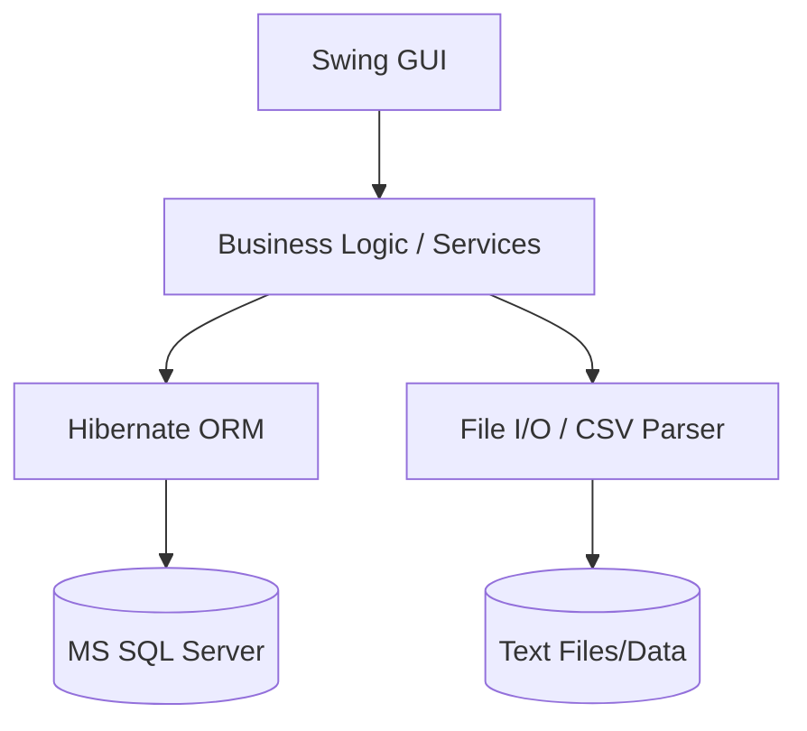
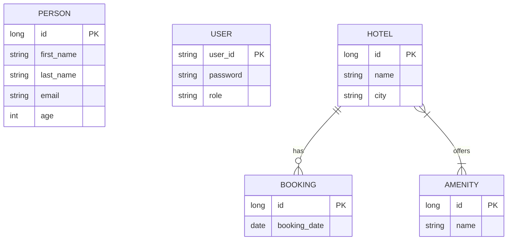

# Technical Documentation - Software Projects FTSS26Y

This document serves as the technical documentation for the **TouristOffice** project, developed as part of the *Software Projects* course in the summer semester 2026.

---

## 1. General Project Information

### Project Overview
*   **Software Name:** TouristOffice
*   **Purpose/Goal:** Management of tourist information (hotels, persons, users) and demonstration of software engineering concepts (CRUD, GUI, Persistence).
*   **Description:** A Java-based desktop application with a Swing GUI and Hibernate integration for managing master data.
*   **Target Audience:** Students of the Software Projects course, administrators of the TouristOffice system.
*   **Problem Solved:** Centralization of data storage and provision of an interactive user interface for data maintenance.
*   **Project Status:** In Progress
*   **Version:** 1.0-SNAPSHOT
*   **Release Date:** [Placeholder: Date of final release]
*   **Responsible Persons/Teams:** Michael Deutsch, Students of the FTSS26Y course.

### Changelog
*   **v0.1:** Initial project structure (Unit 01).
*   **v0.2:** Lombok & File I/O (Unit 02).
*   **v0.3:** ETL processes (Unit 03).
*   **v0.4:** GUI basics & Authentication (Unit 04).
*   **v0.5:** Advanced GUI & JTables (Unit 05).
*   **v0.6:** Event handling & Data transfer (Unit 06).
*   **v0.7:** Database connection with Hibernate & SQL Server (Unit 07).
*   **v0.8:** Advanced Hibernate (Relationships), GUI Designer, E-Mail & PDF Integration (Unit 08).

---

## 2. System Architecture

### Architecture Overview
The system follows a **layered model** (N-Tier), focusing on the separation of user interface (Swing), business logic, and data access (Hibernate/JPA).

*   **Architecture Model:** Desktop Client (Monolithic) with an external SQL database.
*   **Component Overview:**
    *   **GUI Layer:** Swing components (JFrame, JDialog, JTable).
    *   **Logic Layer:** Service classes for processing ETL data and authentication.
    *   **Data Layer:** Hibernate ORM for mapping Java objects to SQL tables.

### Technologies and Frameworks
*   **Language:** Java 21+
*   **GUI:** Java Swing & JFormDesigner
*   **ORM:** Hibernate 6.6.3.Final / Jakarta Persistence 3.1.0
*   **Build Tool:** Maven
*   **Database:** Microsoft SQL Server (Remote)
*   **Utilities:** Lombok 1.18.38, Apache Commons CSV, Jakarta Mail 2.0.1, Apache PDFBox 3.0.7

### Architecture Diagrams

#### Component Diagram (Mermaid)

#### Data Flow Diagram
1.  User enters data into a Swing form.
2.  Controller/Listener validates the input.
3.  Hibernate persists the Entity object in the SQL database.

---

## 3. Technical Requirements

### Hardware Requirements
*   **Processor:** Quad-Core 2.0 GHz or higher.
*   **RAM:** 8 GB (minimum), 16 GB (recommended).
*   **Storage:** 500 MB free space.
*   **Network:** Persistent internet connection for remote database access.

### Software Requirements
*   **Operating System:** Windows 10/11, macOS, or Linux.
*   **JRE/JDK:** Java Development Kit 23 or higher.
*   **Database:** Access to MS SQL Server (via VPN or public IP).

---

## 4. Installation and Configuration

### Build and Run
1.  Clone the repository.
2.  Open the project in IntelliJ IDEA (or another IDE).
3.  Run `mvn clean install` to load dependencies.
4.  Start the application via `src/main/java/unit05/gui_table/TableApplicationMain.java` (or the relevant main class).

### Database Configuration
The connection is configured via `src/main/resources/hibernate.cfg.xml`.
*   Ensure that the `hibernate.connection.url`, `username`, and `password` are correct.
*   The property `hibernate.hbm2ddl.auto` is set to `update` to automatically create tables.

---

## 5. Usage Documentation

### Main Functions
*   **Import:** Loading hotel data from `hotels.txt`.
*   **Display:** Presentation of data in a sortable and filterable `JTable`.
*   **Create:** Adding new entries via a dialog.
*   **Edit:** Double-clicking a table entry opens the edit dialog.

### Developer Documentation
*   **Project Structure:** Standard Maven layout (`src/main/java`, `src/main/resources`).
*   **Coding Standards:** Oriented towards the Java Google Style Guide.
*   **Branching Strategy:** Feature branches with Pull Requests.

---

## 6. API Documentation
*Currently, the project does not use any REST APIs. Internal communication occurs via Java method calls.*

---

## 7. Database Documentation

### Data Model
The project uses Hibernate for automatic table generation (`hbm2ddl.auto=update`).

#### Best Practices & Optimizations (Unit 07 & 08)
*   **Repository Pattern (DAO):** Introduction of DAO classes (e.g., `UserDao`, `HotelDao`) to separate data access from business logic.
*   **Central Session Management:** Use of a central `HibernateUtil` to avoid redundancy.
*   **JPA Mapping:** Use of standardized JPA annotations (`@Entity`, `@Table`, `@Column`, `@Enumerated`) for precise mapping.
*   **Entity Relationships:** Implementation of `@OneToMany` (Hotel -> Booking) and `@ManyToMany` (Hotel <-> Amenity) mappings.
*   **Separation of Concerns:** Externalization of Enums (e.g., `UserRole`) and helper classes into separate files.

#### Key Entities:
*   **PersonEntity:** id (Identity), firstName, lastName, email, age.
*   **UserEntity:** userId (PK), password, role (UserRole: SENIOR, MASTER, NOVICE).

#### ER Diagram (Mermaid)

